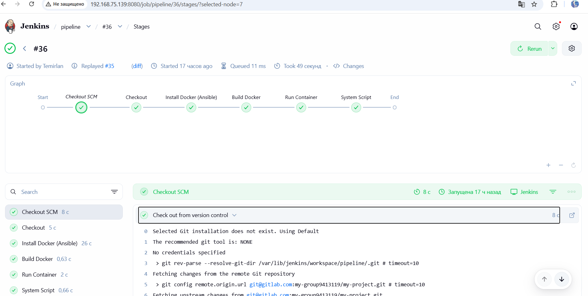
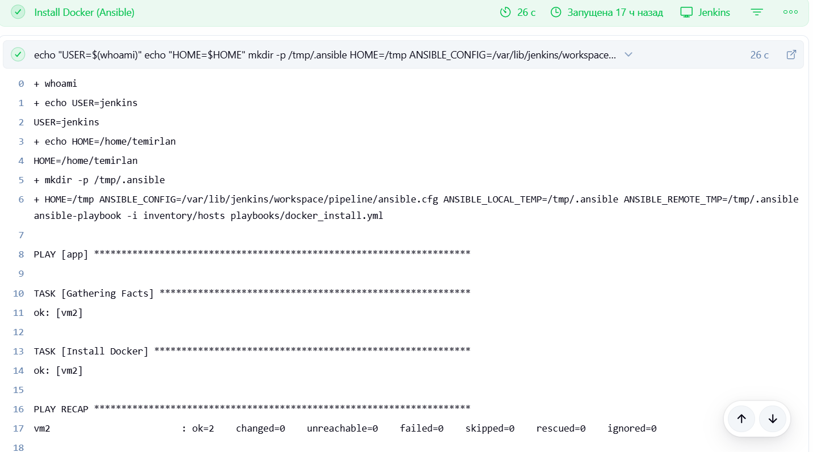
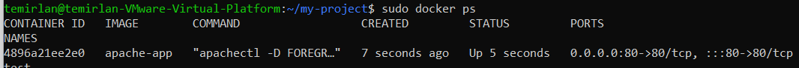
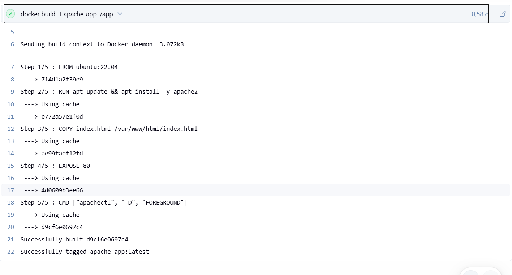

# 🚀 CI/CD Pipeline для автоматического развертывания веб-приложения

[]()
[]()
[]()
[]()
[]()

---

# 📌 Описание проекта

Данный проект демонстрирует полный цикл **CI/CD пайплайна** для автоматического развёртывания веб-приложения в контейнеризированной среде.

В проекте используется подход **Infrastructure as Code (IaC)** и автоматизация всех этапов доставки приложения.

---

# 🏗 Архитектура решения

```text id="arch_ru"
Автор → GitLab → Jenkins → Ansible → VM (Ubuntu)
                                      ↓
                                  Docker Engine
                                      ↓
                               Apache контейнер
                                      ↓
                           Скрипт мониторинга системы на VM2

⚙️ Используемые технологии
Технология	Назначение
Jenkins	    CI/CD автоматизация
Ansible	    Настройка сервера (IaC)
Docker	    Контейнеризация
Ubuntu	    Целевая ОС (VM1, VM2)
Bash	      Скрипты мониторинга VM2
Apache2	    Веб-сервер
Git/GitHub	Контроль версий

Структура проекта
my-project/
├── app/
│   ├── Dockerfile
│   └── index.html
│
├── inventory/
│   └── hosts
│
├── playbooks/
│   └── docker_install.yml
│
├── scripts/
│   └── sysinfo.sh
│
├── Jenkinsfile
├── ansible.cfg
└── README.md
https://github.com/temirlanumbetov/my-project/blob/14e4218ea09a4c5a274d60283c797b56cff90011/images/22.png
🔄 Этапы CI/CD пайплайна
1️⃣ Получение кода (Checkout)

Jenkins забирает последнюю версию проекта из репозитория.


2️⃣ Установка Docker через Ansible


Автоматическая настройка сервера:


установка Docker
настройка окружения
подготовка VM к деплою
ansible-playbook -i inventory/hosts playbooks/docker_install.yml
3️⃣ Сборка Docker образа


docker build -t apache-app ./app
4️⃣ Запуск контейнера


docker rm -f app || true
docker run -d -p 80:80 --name app apache-app
5️⃣ Мониторинг системы

images/22.png
Bash-скрипт собирает:
images/22.png
загрузку CPU
использование RAM
формирует HTML отчёт


🎯 Что демонстрирует проект
CI/CD автоматизация
Infrastructure as Code (IaC)
Docker контейнеризация
Linux администрирование
Jenkins pipeline разработка
Bash мониторинг системы

👤 Автор

Temirlan Umbetov
